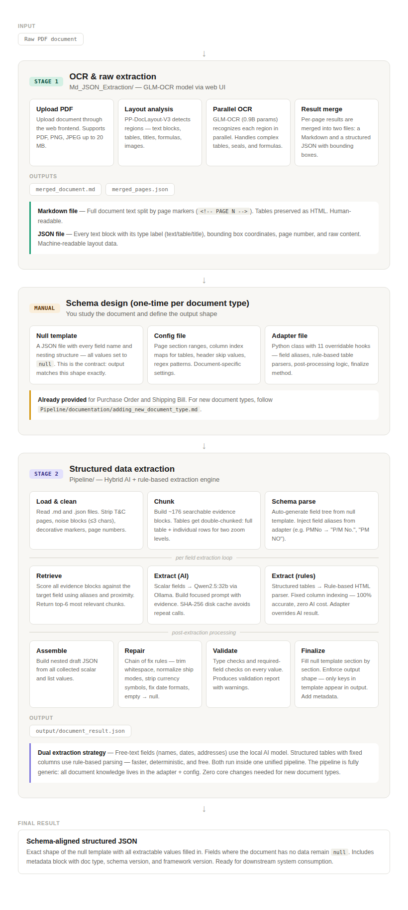
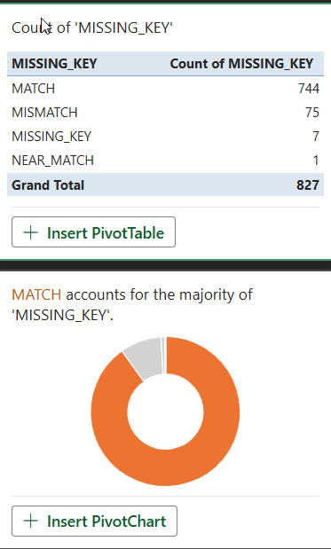
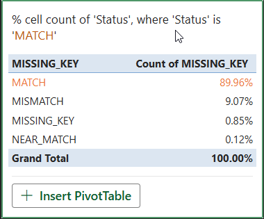
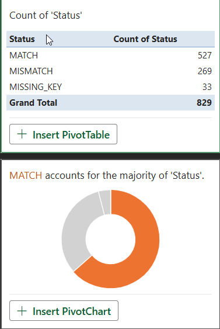
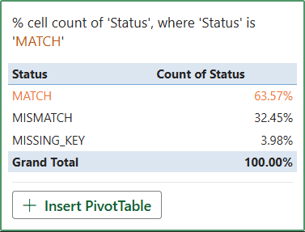
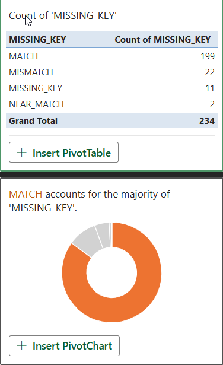
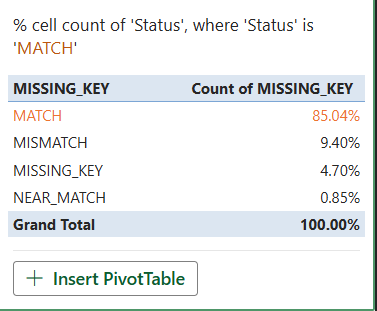
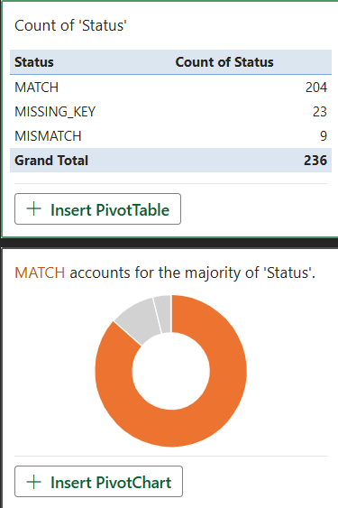
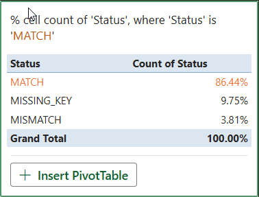

# PDF Document Extraction Pipeline

**Fully Local, End-to-End Pipeline for Extracting Structured JSON from PDF Documents**

*No proprietary APIs · No cloud dependency · Runs entirely on your machine*

---

## About the Project

Commercial documents — purchase orders, shipping bills, invoices — arrive as PDFs but downstream systems need structured data. Manually keying in hundreds of fields across dozens of pages is slow, error-prone, and expensive.

This project solves that problem with an **end-to-end, fully local pipeline** that takes a raw PDF as input and produces a clean, schema-aligned JSON file as output. The entire process is split into two stages, connected by a one-time manual schema design step.

**Two document types ship out of the box:**
- Purchase Order (Li & Fung Placement Memorandum)
- Shipping Bill (Indian Customs Shipping Bill)

Adding a new document type requires **zero changes to any core file** — just an adapter, a config, and a null template.

---

## High-Level Workflow

The pipeline runs in three phases: OCR extraction, manual schema design (one-time), and structured data extraction. Each phase is self-contained with its own inputs and outputs.

---

### Stage 1 — OCR & Raw Extraction (`Md_JSON_Extraction/`)

This stage converts a raw PDF into machine-readable text and layout data. It uses **GLM-OCR**, an open-source multimodal OCR model (0.9B parameters) built on the GLM-V encoder–decoder architecture, combined with **PP-DocLayout-V3** for layout analysis.

**What happens internally:**

1. **Upload** — You upload a PDF (or image) through a web-based frontend (React 19 + Vite). The backend (FastAPI, async task queue) creates an OCR task and begins processing.

2. **Layout Detection** — PP-DocLayout-V3 analyzes each page and detects visual regions: text blocks, tables, titles, formulas, images, seals, and other elements. Each region gets a bounding box and a type label.

3. **Parallel Recognition** — GLM-OCR processes each detected region in parallel. It handles complex table structures, mathematical formulas, stamps/seals, and code-heavy documents. Multi-Token Prediction (MTP) loss and reinforcement learning keep accuracy high across diverse layouts.

4. **Result Merge** — Per-page OCR results are merged into two output files that cover the entire document.

**What you get at the end:**

| Output File | What It Contains |
|---|---|
| `merged_document.md` | Full document text, split by `<!-- PAGE N -->` markers. Tables preserved as raw HTML. Human-readable. |
| `merged_pages.json` | Every OCR block with its type label (`text`, `table`, `title`), bounding box coordinates (`bbox_2d`), page number, and raw content. Machine-readable layout data. |

> **📖 For setup, deployment, and run instructions → see `Md_JSON_Extraction/README.md`**

---

### Manual Step — Schema Design (One-Time Per Document Type)

Before the extraction pipeline can process a document type, you need to tell it **what to extract**. This is a one-time manual step where you study the real document and express your understanding in three files.

**Null Template** — A JSON file with the exact output shape you want. Every field name, every nesting level (Header, Body, Footer, RowWiseTable, Details), every list slot — all values set to `null`. This is the **contract**: the pipeline output will match this shape exactly, nothing more, nothing less.

**Config File** — Document-specific settings: which pages contain the header vs. items vs. footer vs. T&C, column index maps for each table layout variant, header/totals row skip values, regex patterns for specific fields.

**Adapter File** — A Python class with 11 overridable hooks. This is where you define field aliases (so the retriever knows that "PMNo" also appears as "P/M No." in the document), rule-based table parsers for structured tables, post-processing logic, and the finalize method that fills the null template section by section.

Purchase Order and Shipping Bill schemas, configs, and adapters are **already provided**. For new document types, adding a new type requires zero changes to any core file — just three new files and one line in the plugin registry.

> **📖 For detailed schema design guidance → see `Pipeline/documentation/manual_work_guide.md`**
>
> **📖 For adding a new document type step-by-step → see `Pipeline/documentation/adding_new_document_type.md`**

---

### Stage 2 — Structured Data Extraction (`Pipeline/`)

This is the core extraction engine. It reads the OCR outputs from Stage 1, applies a hybrid AI + rule-based extraction strategy, and produces a fully structured JSON result.

**What happens internally — the 11-step assembly line:**

| Step | Name | What Happens |
|---|---|---|
| 1 | **Load Markdown** | Read the `.md` file, split by page markers, strip T&C pages (configurable). |
| 2 | **Load JSON** | Read the `.json` file, unwrap OCR blocks per page (handles double-wrapping). |
| 3 | **Clean Inputs** | Adapter strips noise blocks (≤3 chars), page number markers, decorative lines. |
| 4 | **Build Evidence Store** | Merge both inputs into searchable chunks. Tables are double-chunked: one full TABLE block + one TABLE_ROW per row — two zoom levels for two different retrieval needs. |
| 5 | **Parse Schema + Inject Aliases** | Auto-generate a field tree from the null template. Inject aliases from the adapter (e.g., `PMNo` → `["P/M No.", "P/M NO", "PM NO"]`). |
| 6 | **Extract Scalar Fields** | For each scalar field: retrieve top-6 evidence blocks → check SHA-256 disk cache → build focused prompt → call Qwen2.5:32b locally via Ollama → parse response → adapter post-processes. |
| 7 | **Extract List Fields** | For structured tables: the adapter **overrides AI** and runs a rule-based HTML table parser. Fixed column indexing is 100% accurate, deterministic, and free. |
| 8 | **Assemble** | Build a nested draft JSON dictionary from all collected scalar and list values. |
| 9 | **Repair** | A chain of fix rules runs over every field: trim whitespace, empty string → null, strip currency symbols, normalize ship modes, fix PM number prefixes. |
| 10 | **Validate** | Type checks (strings, numbers, lists) and required-field checks. Produces a validation report with warnings. |
| 11 | **Finalize** | Fill the null template section by section. Enforce the critical rule: only keys already in the template can appear in the output. Add metadata (`schema_version`, `source`, `_meta`). Save to disk. |

**The dual extraction strategy in detail:**

The pipeline uses **two extraction methods** and picks the right one per field:

| Method | Used For | How It Works | Accuracy | Cost |
|---|---|---|---|---|
| **AI Extraction** (Qwen2.5:32b via Ollama) | Free-text fields — names, dates, addresses, terms | Retriever finds relevant chunks → prompt is built with evidence → local LLM extracts the value | High (with repair rules) | ~2-5 sec per field |
| **Rule-Based Parsing** | Structured tables with fixed column positions | HTML table parser reads `<td>` elements by index, using column maps from the config | 100% (deterministic) | Near-instant |

The adapter decides which method wins for each field. For tables where column positions are known, the rule-based parser **completely replaces** the AI — faster, more accurate, and free.

**What you get at the end:**

A single JSON file in `Pipeline/output/` that matches the null template shape exactly. A console summary reports validation status, field fill rate, and elapsed time.

> **📖 For setup, configuration, and run instructions → see `Pipeline/README.md`**
>
> **📖 For architecture deep-dive → see `Pipeline/documentation/architecture_and_workflow.md`**
>
> **📖 For chunking and scoring strategy → see `Pipeline/documentation/chunking_and_scoring.md`**

---

## Getting Started

### Prerequisites

- Python 3.11+
- Node.js >= 18 and pnpm >= 8 (for the OCR frontend)
- Ollama with `qwen2.5:32b` model pulled locally
- GPU recommended for OCR model inference

---

### Step 1 — Run OCR & Raw Extraction

Navigate to the `Md_JSON_Extraction/` folder. Upload your PDF through the web UI, let GLM-OCR process it, and download the Markdown and JSON output files.

> **📖 Detailed instructions inside `Md_JSON_Extraction/README.md`**

---

### Step 2 — Create a Manual Schema (If Needed)

If you are processing a Purchase Order or Shipping Bill, schemas are already provided in `Pipeline/schemas/`. Skip to Step 3.

For a new document type, study the document and create a null template, config, and adapter.

> **📖 Detailed instructions inside `Pipeline/documentation/manual_work_guide.md` and `Pipeline/documentation/adding_new_document_type.md`**

---

### Step 3 — Run the Extraction Pipeline

Navigate to the `Pipeline/` folder. Place your OCR outputs in the data directory and run the pipeline.

> **📖 Detailed instructions inside `Pipeline/README.md`**

---

## Sample Results

### Purchase Order Extraction

#### Our Pipeline (Qwen2.5:32b + Rule-Based)

<table align="center"><tr>
<td align="center"></td>
<td align="center"></td>
</tr></table>

#### GPT-Based Extraction (Comparison)

<table align="center"><tr>
<td align="center"></td>
<td align="center"></td>
</tr></table>

---

### Shipping Bill Extraction

#### Our Pipeline (Qwen2.5:32b + Rule-Based)

<table align="center"><tr>
<td align="center"></td>
<td align="center"></td>
</tr></table>

#### GPT-Based Extraction (Comparison)

<table align="center"><tr>
<td align="center"></td>
<td align="center"></td>
</tr></table>

---

## Key Technologies

| Component | Technology | Role |
|---|---|---|
| OCR Model | GLM-OCR (0.9B params, BF16) | Multimodal document recognition |
| Layout Analysis | PP-DocLayout-V3 | Visual region detection on each page |
| AI Extraction | Qwen2.5:32b via Ollama | Local LLM for free-text field extraction |
| OCR Backend | FastAPI, Python 3.12, async workers | Async task queue with retry and recovery |
| OCR Frontend | React 19, TypeScript, Vite, Tailwind CSS | Upload UI with real-time progress tracking |
| Pipeline Engine | Python, rule-based + AI hybrid | Generic extraction with plugin architecture |
| Caching | SHA-256 disk-backed response cache | Avoids repeat AI calls on re-runs |

---

## Documentation Index

| Document | Location | What It Covers |
|---|---|---|
| OCR Setup & Usage | `Md_JSON_Extraction/README.md` | Model deployment, SDK usage, configuration |
| OCR Backend | `Md_JSON_Extraction/apps/backend/README.md` | FastAPI service, task queue, API endpoints |
| OCR Frontend | `Md_JSON_Extraction/apps/frontend/README.md` | React app setup, development, Docker |
| Pipeline Setup & Usage | `Pipeline/README.md` | Installation, running, folder structure |
| Architecture & Workflow | `Pipeline/documentation/architecture_and_workflow.md` | Full 13-step extraction walkthrough |
| Manual Work Guide | `Pipeline/documentation/manual_work_guide.md` | What you must do manually per document type |
| Adding New Document Types | `Pipeline/documentation/adding_new_document_type.md` | Step-by-step guide, zero core changes |
| Chunking & Scoring | `Pipeline/documentation/chunking_and_scoring.md` | How documents are split and ranked |

---

## Authors

**AmanPant(MTQ3KOR)— ERD Intern 2026**

---
